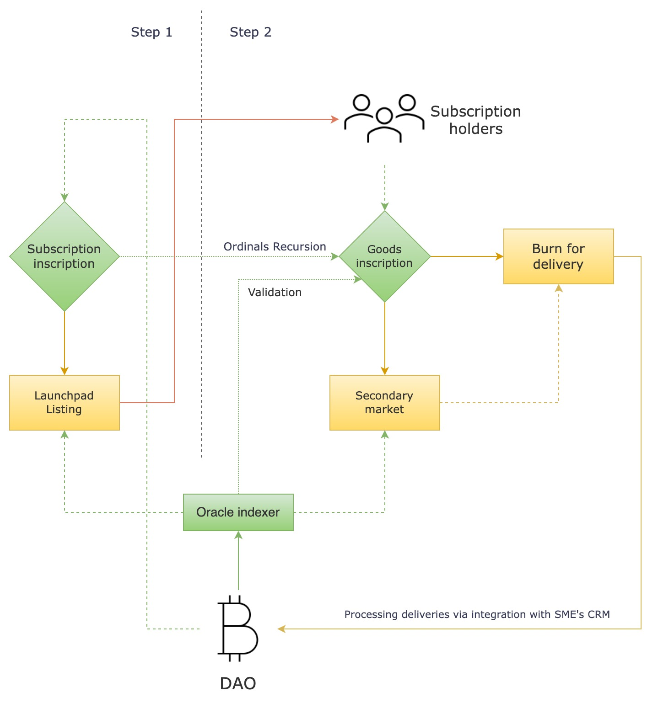

# 📬 Goods redemptions

The process of redeeming orders will include the procedure of burning goods inscriptions – sending them to a burn address specified in the DAO inscription. The validator-indexer will consider burnt inscriptions as not valid and remove them from the collection of valid goods inscriptions. Satoshis used in the redeemed inscriptions can be further reclaimed by the DAO, effectively destroying the inscription on-chain.

<figure><figcaption></figcaption></figure>

The business logic of the redemption, implemented by off-chain integration with the SME’s CRM, will consider burning the product instance (goods) inscription as the confirmation of the off-chain shipping order.

For some special business cases, the protocol enables making goods inscriptions to be permanent, which are not required to be burnt for redemption, but instead, the redemption process is governed by the second layer of business logic implemented with certificates.

For additional transparency, the URL of the DAO SME integration webhook can be inscribed in the DAO inscription, with the API endpoint following the community-defined standard for the decentralization of redemption governance. The protocol can utilize SPV and ZK proofs, enabling offline redemption, and decentralized (ZK proof-based) redemption verification, all with the protection of sensitive personal data of users.
