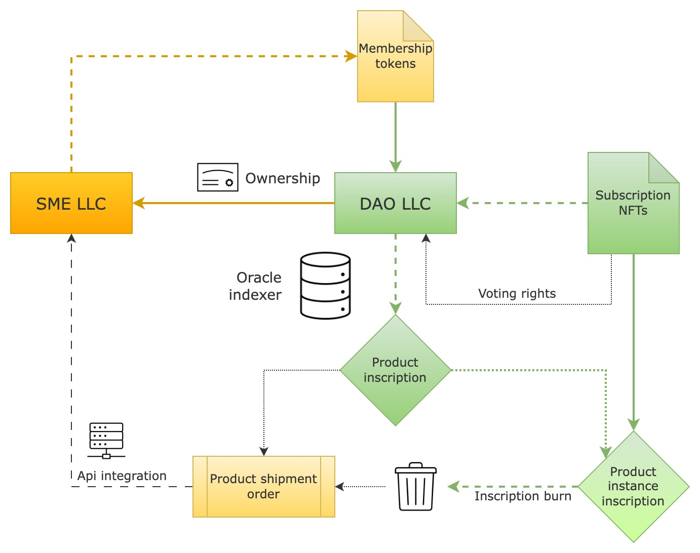

# 🏛 Governance principles

We envision although this is not a necessary part of the protocol, that the DAO will be registered officially as a limited liability company, and the stake of the SME business, issuing subscriptions, will be put on the balance of the DAO. All subscription NFTs and product instances (goods) NFTs will be also bound to the unilateral contract entered by the DAO.

<figure><figcaption></figcaption></figure>

DAO will be governed by membership tokens, and as a potential optimal structure, we envision that at the very beginning, the whole stake will be held by SME owners and partners, and in the future with the product's success membership tokens can be offered to the public (e.g., with the option executed to acquire the whole SME, as an equivalent of the IPO).

DAO will be governed by membership tokens, and as a potential optimal structure, we envision that at the very beginning, the whole stake will be held by SME owners and partners, and in the future with the product's success membership tokens can be offered to the public (e.g., with the option executed to acquire the whole SME, as an equivalent of the IPO).

We also envision that DAOs will set the rules to forcibly transform subscriptions into membership tokens on specified conditions in case of a DAO IPO.

Some DAOs, subject to DAO LLC’s charters, with issued subscription NFTs can grant specific voting rights, although without any profit bearing (like associated with DAO membership tokens). Voting rights, together with other potential community engagement solutions, such as MLM will be an essential part of the future iterations of the Ordinals DAO toolkit.

The DAO charters, subscription terms & conditions, and other documents together with the LLC information, can also be inscribed to the Bitcoin blockchain, to permanently link the legally-binding materials with all issued product inscriptions.
